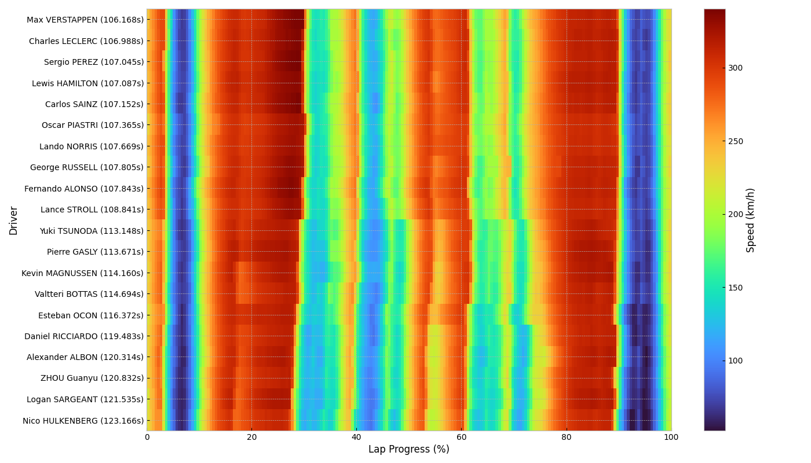
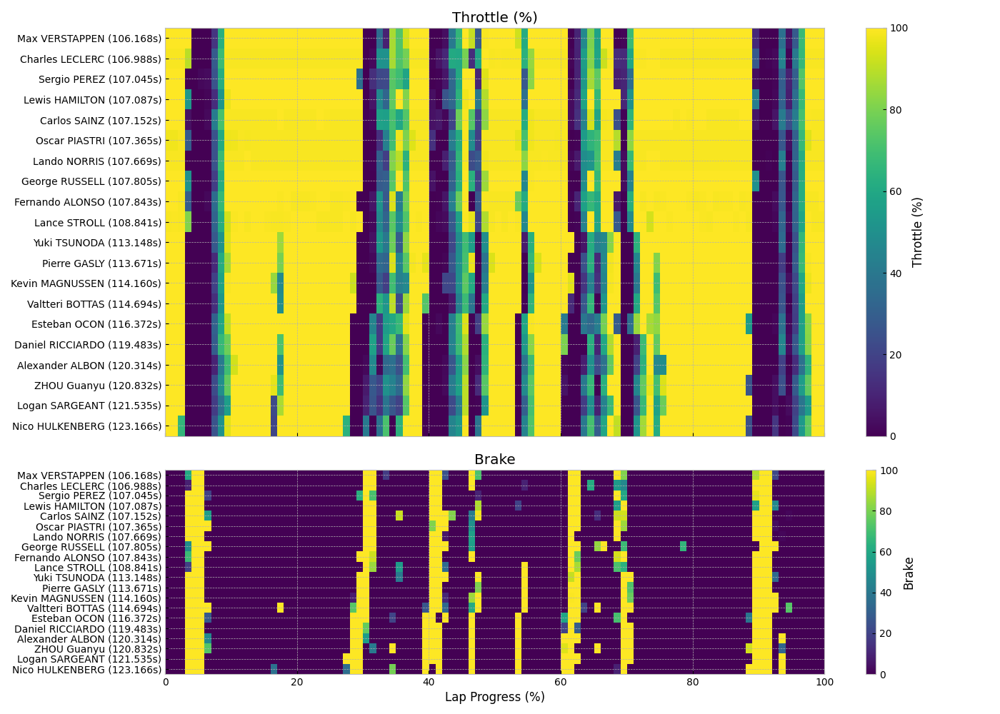
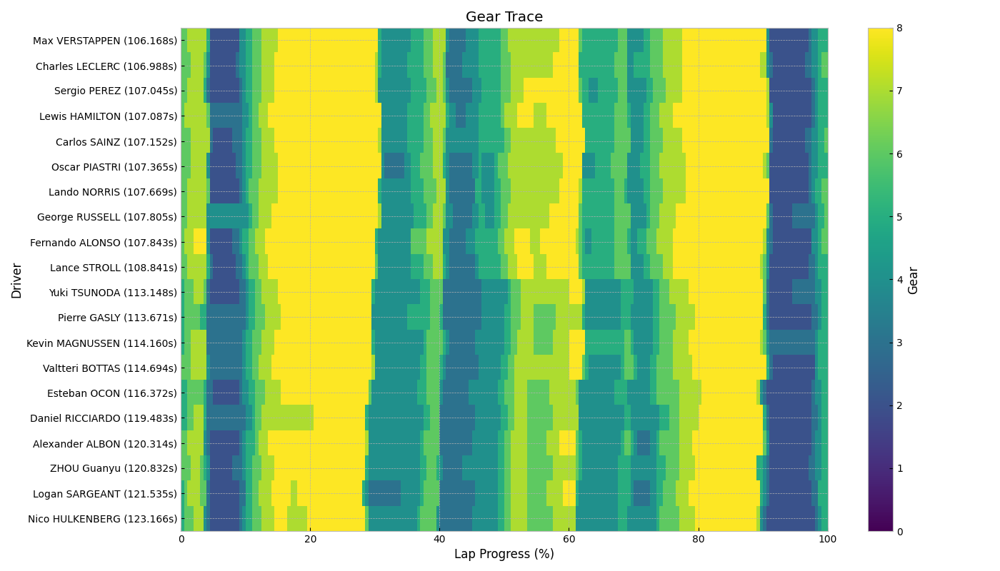

# F1 Analysis

<a target="_blank" href="https://cookiecutter-data-science.drivendata.org/">
    
</a>

Analysis of OpenF1 API data.

## Installation

To install the package, first make sure you have [uv installed](https://docs.astral.sh/uv/getting-started/installation/#installation-methods) (you can always check this using `uv --version`).

```bash
uv sync
```

## Usage

To run module code (at `f1_analysis/__main__.py`) use `uv run python -m f1_analysis`, and to see the input arguments and defaults, use the `--help` flag.

### Examples

Running `uv run python -m f1_analysis` with no args will show Qualifying outcome for the Spa-Francorchamps in Belgium from 2023. It will show the speed vs lap progress, throttle/brake vs lap progress, and gear trace vs lap progress. Below are the plots:





> [!NOTE]
> Note that there currently is a rate limit set by OpenF1, so there will be a 60 seconds timeout during the request of the data for this visualization.

To see all options for circuits, locations, etc., given a year then use `uv run python -m f1_analysis --year 2023 --year_options`. This will show the full version of the table below:

```text
shape: (29, 11)
┌─────────────────────┬──────────────┬──────────────┬─────────────────────┬─────────────────────┬────────────┬──────────────┬────────────┬──────────────┬──────────────┬──────┐
│ circuit_short_name  ┆ country_code ┆ country_name ┆ date_end            ┆ date_start          ┆ gmt_offset ┆ is_cancelled ┆ location   ┆ session_name ┆ session_type ┆ year │
│ ---                 ┆ ---          ┆ ---          ┆ ---                 ┆ ---                 ┆ ---        ┆ ---          ┆ ---        ┆ ---          ┆ ---          ┆ ---  │
│ str                 ┆ str          ┆ str          ┆ datetime[μs, UTC]   ┆ datetime[μs, UTC]   ┆ str        ┆ bool         ┆ str        ┆ str          ┆ str          ┆ i16  │
╞═════════════════════╪══════════════╪══════════════╪═════════════════════╪═════════════════════╪════════════╪══════════════╪════════════╪══════════════╪══════════════╪══════╡
│ Sakhir              ┆ BRN          ┆ Bahrain      ┆ 2023-03-04 16:00:00 ┆ 2023-03-04 15:00:00 ┆ 03:00:00   ┆ false        ┆ Sakhir     ┆ Qualifying   ┆ Qualifying   ┆ 2023 │
│                     ┆              ┆              ┆ UTC                 ┆ UTC                 ┆            ┆              ┆            ┆              ┆              ┆      │
│ …                   ┆ …            ┆ …            ┆ …                   ┆ …                   ┆ …          ┆ …            ┆ …          ┆ …            ┆ …            ┆ …    │
│ Yas Marina Circuit  ┆ UAE          ┆ United Arab  ┆ 2023-11-25 15:00:00 ┆ 2023-11-25 14:00:00 ┆ 04:00:00   ┆ false        ┆ Yas Island ┆ Qualifying   ┆ Qualifying   ┆ 2023 │
│                     ┆              ┆ Emirates     ┆ UTC                 ┆ UTC                 ┆            ┆              ┆            ┆              ┆              ┆      │
└─────────────────────┴──────────────┴──────────────┴─────────────────────┴─────────────────────┴────────────┴──────────────┴────────────┴──────────────┴──────────────┴──────┘
```

All string type columns from the table above can be used as an input to the `--session_attribute` argument, and its column values can be used as `--session_value`. If the value is not unique, the first session match from the DataFrame will be used for the visualization.
